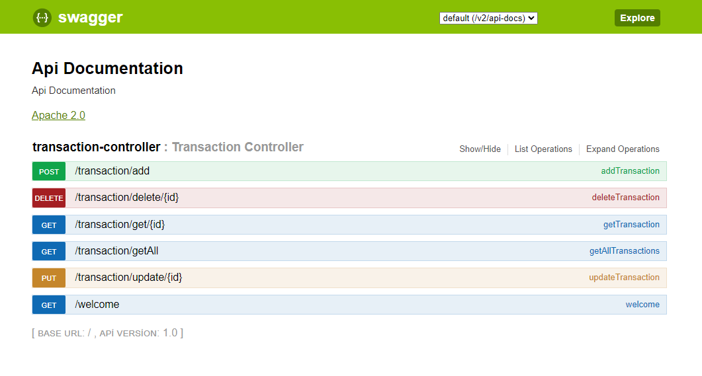

Transaction Control System:
---

Bu projede genel olarak elimizde bulunan transactionlara apiler yardımıyla CRUD işlemleri yapılması işlemleri uygulanmıştır.

Bu projede kullanılan teknolojiler aşağıda verilmiştir.

---

1. Veritabanı olarak PostgreSQL tercih edilmiştir.
2. Java versiyonu olarak 1.8 kullanılmıştır.
3. Arayüz belgeleri oluşturmak, görselleştirmek ve yönetmek için swagger kullanıldı.
4. API'lerin testi için ayrıyeten postman kullanılabilir.
5. Veritabanını yönetim sistemi olarak da hibernate kullanılmıştır.

---

Projede kullanılabilir API'ler aşağıda belirtilmiştir:

Burada CRUD operasyonu için gereken bütün API'lar bulunmaktadır.

---

6 Api'ımız şu işe yaramaktadır.
1. transaction/getAll: Veritabanımızın içindeki bütün transaction'ları getirmektedir.
2. transaction/get: Veritabanımızın içindeki verilen spesifik id'ye karşılık gelen transaction'ı getirmektedir.
3. transaction/add: Veritabanımızın içine yeni bir transaction ekleme işi yapar.
4. transaction/delete: Veritabanımızın içinden verilen spesifik id'ye karşılık gelen transaction'ı siler.
5. transaction/update: Veritabanımızın içine verilen spesifik id'ye karşılık gelen transaction'ı güncelleme işlemi yapar.
6. welcome: Welcome to Transaction Service! response'unu döndürür.

---
